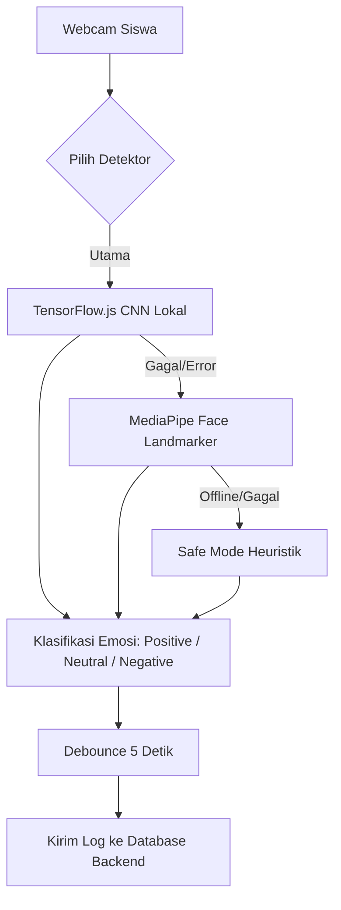

# DOKUMENTASI AI (AI ENGINE DOCUMENTATION)
## Emotion-Aware Adaptive Math Learning AI & AR Platform

Dokumentasi ini menjelaskan arsitektur sistem cerdas, model kecerdasan buatan (AI), orkestrasi model bahasa besar (LLM), serta implementasi logika fuzzy (expert system) yang digunakan untuk menyesuaikan antarmuka dan materi belajar siswa secara real-time.

---

## 🎯 1. Filosofi Adaptasi (SDG 4: Quality Education)
Sistem AI ini dirancang untuk mendeteksi kondisi psikologis (emosi) siswa saat mempelajari matematika dan memodifikasi lingkungan belajar mereka secara adaptif. Tujuan utamanya adalah untuk mengurangi **Math Anxiety** (kecemasan matematika), memelihara motivasi belajar, dan menyesuaikan gaya penyampaian materi sesuai dengan gaya belajar siswa:
*   **Visual**: Pendekatan grafis, diagram, dan skema spasial.
*   **Auditory**: Pendekatan audio, pembacaan materi interaktif (TTS).
*   **Kinesthetic**: Pendekatan interaksi spasial 3D berbasis Augmented Reality (AR).

---

## 🎭 2. Deteksi Emosi Wajah (Client-Side Computer Vision)

Deteksi emosi dilakukan secara real-time langsung di peramban (browser) siswa menggunakan webcam. Hal ini melindungi privasi siswa (video tidak pernah dikirim ke server luar) dan menghemat bandwidth serta biaya komputasi server.



### A. Tier 1: TensorFlow.js CNN Lokal (Model Utama)
*   **Lokasi Penyimpanan**: `frontend/public/model/tfjs_model/`
*   **Deskripsi**: Browser memuat file model arsitektur `model.json` dan bobot `*.bin` secara mandiri (*self-hosted*). Model ini mengklasifikasikan ekspresi wajah menjadi emosi: `Happy`, `Neutral`, `Anxious`, `Confused`, `Frustrated`, `Sad`, dan `Surprised`.
*   **Normalisasi**: Hasil klasifikasi dinormalisasi menjadi kategori emosi dasar:
    *   `Positive` (Happy)
    *   `Neutral` (Neutral, Surprised)
    *   `Negative` (Anxious, Confused, Frustrated, Sad)

### B. Tier 2: MediaPipe Face Landmarker (Fallback Pertama)
*   Jika model TensorFlow.js lokal gagal dimuat, program menangkap exception tersebut dan melakukan fallback ke pustaka MediaPipe Face Landmarker.
*   MediaPipe mendeteksi koordinat landmark (titik kunci) wajah dan mengekstrak emosi menggunakan logika heuristik dari parameter kedipan mata, senyuman mulut, serta posisi alis mata (*blendshapes*).

### C. Tier 3: Safe Mode & Histori Log (Fallback Akhir)
*   Jika kedua pustaka di atas gagal dimuat (misal karena jaringan terputus), aplikasi tidak akan crash. Detektor beralih ke mode 'none' dan sistem menggunakan rata-rata log emosi historis di database untuk memprediksi emosi siswa secara aman.

### D. Optimasi Sinkronisasi (Debouncing)
*   Webcam memindai wajah siswa setiap 1 detik. Namun, untuk menghindari banjir request jaringan (*network flooding*), hasil deteksi dikumpulkan dan dikirimkan ke backend melalui metode **debounce** setiap **5 detik**.

---

## 🤖 3. Orkestrasi LLM (Large Language Model) Multi-Tier

Untuk menghasilkan pertanyaan kuis yang dinamis, memberikan umpan balik (feedback) langkah demi langkah, dan menyusun materi remedial personal secara instan, backend mengimplementasikan arsitektur **Multi-Tier LLM Fallback**.

```
Tier 1 (Utama): NVIDIA NIM API (Llama 3.1 8B Instruct)
      │
      ├─── [Gagal / Rate Limit] ───► Tier 2: Google Gemini API (Gemini 2.0 Flash)
                                           │
                                           └─── [Gagal / Quota Limit] ───► Tier 3: Mistral AI (Mistral Small)
```

### Layanan LLM yang Digunakan:
1.  **NVIDIA NIM API (Tier 1)**: Menggunakan model ultra-cepat `meta/llama-3.1-8b-instruct`.
2.  **Google Gemini API (Tier 2)**: Menggunakan model `gemini-2.0-flash`.
3.  **Mistral AI (Tier 3)**: Menggunakan model `mistral-small-latest`.

### Penerapan LLM pada Fitur Aplikasi:

#### A. Pembuatan Soal Kuis Adaptif (`POST /api/quiz/generate`)
LLM merumuskan soal matematika berdasarkan topik bab saat itu dengan menyisipkan instruksi adaptif:
*   **Siswa Cemas (Negative)**: LLM diminta menghasilkan soal dengan tingkat kesulitan lebih mudah, menyertakan kalimat pembuka yang menenangkan, serta petunjuk (*hint*) yang sangat membantu.
*   **Siswa Percaya Diri (Positive/Happy)**: LLM memberikan soal yang lebih menantang (High Order Thinking Skills) untuk memelihara ketertarikan belajar.

#### B. Feedback Cerdas Terpersonalisasi (`POST /api/quiz/feedback`)
LLM mengevaluasi jawaban siswa, memberikan penjelasan pengerjaan matematis yang rinci menggunakan format LaTeX, dan menyisipkan pesan motivasi psikologis yang relevan dengan emosi yang dirasakan siswa saat mengerjakan soal tersebut.

#### C. Ringkasan Materi Remedial Personal (`POST /api/student/material/[id]/remedial`)
Jika siswa gagal mencapai standar nilai kuis, LLM dipanggil untuk membaca ringkasan kesalahan pengerjaan kuis siswa, gaya belajar mereka (Visual/Auditory/Kinesthetic), dan emosi negatif mereka. LLM kemudian menyusun modul remedial kustom (Markdown format) khusus untuk siswa tersebut.

#### D. AI Refine untuk Guru (`POST /api/teacher/material/refine-preview`)
Membantu guru menyempurnakan struktur penulisan materi pelajaran matematika, mengoreksi rumus LaTeX, dan menyusun subbab materi secara otomatis sebelum dipublikasikan.

---

## 🧮 4. Sistem Logika Fuzzy (Fuzzy Logic Expert System)

Logika fuzzy digunakan sebagai pengambil keputusan (*expert system*) untuk menentukan adaptasi UI dan tingkat kesulitan belajar siswa secara instan tanpa perlu memanggil API LLM berbayar setiap detik.

### Variabel Input (Fuzzification):
1.  **Status Emosi**: `Positive` (nilai kepercayaan diri tinggi), `Neutral`, `Negative` (tingkat cemas/bingung tinggi).
2.  **Performa Kuis**: Jumlah jawaban salah berturut-turut (`wrongCount`).
3.  **Kecepatan Menjawab**: Durasi waktu pengerjaan soal dibandingkan batas normal.

### Skema Aturan Adaptasi (Rule Base):
*   **Kecemasan Tinggi (Anxious / Negative Emotion)**:
    *   *Keputusan*: Kurangi tingkat kesulitan soal kuis satu tingkat (Hard -> Medium -> Easy), aktifkan opsi petunjuk secara otomatis, dan sederhanakan tata letak teks materi.
*   **Kebingungan Berulang (Wrong Count >= 3)**:
    *   *Keputusan*: Memicu popup interaktif **Latihan Pernapasan (Breathing Exercise)** di layar siswa (tarik napas 4 detik, tahan 4 detik, embuskan 4 detik) untuk meredakan ketegangan psikologis.
*   **Fokus & Percaya Diri (Positive / Happy Emotion)**:
    *   *Keputusan*: Naikkan tingkat kesulitan kuis, sembunyikan petunjuk awal (menuntut kemandirian), dan ubah tema warna UI menjadi cerah/aktif.

### Hubungan Variabel Masukan ke Konfigurasi Output:
```text
Siswa Terdeteksi Cemas (Negative) & Jawaban Salah Berulang
                   │
                   ▼ Logika Fuzzy
┌─────────────────────────────────────────────────────────┐
│ Output Adaptasi:                                         │
│ 1. Tema Warna UI   -> Mode CALM (Biru lembut menenangkan)│
│ 2. Hint Display    -> Ditampilkan otomatis              │
│ 3. Kompleksitas    -> Teks disederhanakan               │
│ 4. Soal Kuis       -> Turun ke EASY                     │
│ 5. Pemicu Khusus   -> Popup Latihan Pernapasan          │
└─────────────────────────────────────────────────────────┘
```

---

## 🛡️ 5. Kontrol Stabilitas UI (Anti-Flicker & Hold-Time)

Ketika emosi siswa berubah dengan cepat (misal dari terkejut/surprised kembali ke netral), perubahan antarmuka warna UI yang terlalu cepat (flip-flop) dapat memecah konsentrasi belajar siswa. Oleh karena itu, sistem menerapkan **Kontrol Kestabilan Kognitif**:

1.  **Fuzzy Update Debounce (4 detik)**:
    *   Klasifikasi emosi baru hanya akan dipertimbangkan oleh pengatur logika adaptasi visual jika status emosi tersebut bertahan minimal selama 4 detik berturut-turut.
2.  **Minimum Theme Hold-Time (60 detik)**:
    *   Begitu tema warna antarmuka (misal tema CALM biru untuk emosi cemas) diaktifkan, tema tersebut dikunci dan ditahan selama minimal 60 detik sebelum diizinkan berganti ke tema lain, memberikan stabilitas visual bagi siswa.
